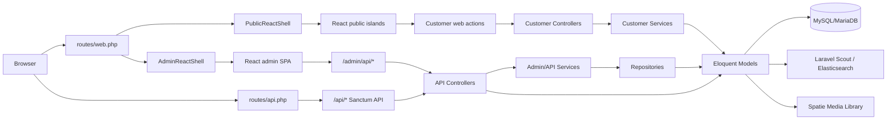

# Cosmetic Shop React + Laravel

Ứng dụng thương mại điện tử bán mỹ phẩm được xây dựng bằng **Laravel 11**, **React 19**, **Vite** và mô hình **React islands**. Dự án có hai khu vực chính: website khách hàng và trang quản trị admin dạng SPA, dùng chung backend Laravel, Eloquent models, service/repository layer và các API JSON.

## Mục lục

- [Tổng quan](#tổng-quan)
- [Tính năng chính](#tính-năng-chính)
- [Công nghệ sử dụng](#công-nghệ-sử-dụng)
- [Kiến trúc hệ thống](#kiến-trúc-hệ-thống)
- [Cấu trúc thư mục](#cấu-trúc-thư-mục)
- [Yêu cầu môi trường](#yêu-cầu-môi-trường)
- [Cài đặt và chạy local](#cài-đặt-và-chạy-local)
- [Cấu hình quan trọng](#cấu-hình-quan-trọng)
- [Routes và API](#routes-và-api)
- [Mô hình dữ liệu](#mô-hình-dữ-liệu)
- [Testing và quality checks](#testing-và-quality-checks)
- [Ghi chú phát triển](#ghi-chú-phát-triển)
- [License](#license)

## Tổng quan

Dự án hiện phục vụ các nghiệp vụ phổ biến của một cửa hàng mỹ phẩm online:

- Khách hàng duyệt sản phẩm theo danh mục/thương hiệu, xem chi tiết, đánh giá, thêm giỏ hàng, checkout, xem đơn hàng, quản lý tài khoản và wishlist.
- Admin đăng nhập bằng guard riêng, quản lý catalog, đơn hàng, khách hàng, bình luận, khuyến mãi, phí ship, media, newsletter, role và staff.
- Frontend React được mount từ Laravel shell thay vì dùng một SPA độc lập hoàn toàn. Public shell nằm ở `App\Support\PublicReactShell`, admin shell nằm ở `App\Support\AdminReactShell`.

## Tính năng chính

### Website khách hàng

- Trang chủ `/` render React component `Home` với dữ liệu từ `CustomerHomeService`.
- Danh sách sản phẩm `/products`, lọc theo danh mục `/categories/{category}` và thương hiệu `/brands/{brand}`.
- Trang chi tiết sản phẩm `/products/{product}` và gửi review qua `/products/{product}/reviews`.
- Đăng ký, đăng nhập, đăng xuất bằng guard web mặc định.
- Đăng nhập mạng xã hội Google/Facebook qua Laravel Socialite.
- Giỏ hàng, cập nhật số lượng, xóa sản phẩm khỏi giỏ.
- Checkout, lịch sử đơn hàng, chi tiết đơn hàng và hủy đơn.
- Trang tài khoản khách hàng và wishlist.
- Chatbot message endpoint tại `/chatbot/messages`.

### Trang quản trị admin

- Admin login/logout tại `/admin/login` và `/admin/logout`.
- Admin SPA catch-all tại `/admin/{path?}` sau khi qua middleware `admin`.
- Dashboard tổng quan.
- Quản lý catalog: brands, categories, products, media và product comments.
- Quản lý bán hàng: orders, discounts, fee ships, customers.
- Quản lý newsletter: danh sách email và gửi email newsletter.
- Quản lý nhân sự và phân quyền: staffs, roles.
- Phân quyền theo role:
  - `MANAGER`: toàn quyền, gồm role/staff.
  - `ADMIN`: quản lý catalog và nghiệp vụ bán hàng chính.
  - `STAFF`: chủ yếu xem/xử lý order, customer, discount/feeship read-only theo route hiện tại.

## Công nghệ sử dụng

### Backend

| Thành phần | Gói/Phiên bản |
|---|---|
| PHP | `^8.2` |
| Framework | `laravel/framework ^11.0` |
| Auth/API token | `laravel/sanctum ^4.0` |
| Social login | `laravel/socialite ^5.14` |
| Search | `laravel/scout`, `matchish/laravel-scout-elasticsearch`, `elasticsearch/elasticsearch` |
| Media | `spatie/laravel-medialibrary ^11.13` |
| Test PHP | PHPUnit 10 |
| Dev tools | Laravel Pint, Sail, Tinker, Ignition |

### Frontend

| Thành phần | Gói/Phiên bản |
|---|---|
| React | `^19.2.6` |
| React DOM | `^19.2.6` |
| Vite | `^6.4.2` |
| Laravel Vite Plugin | `^1.0.0` |
| HTTP client | Axios |
| Test JS | Vitest, Testing Library, Happy DOM/JSDOM |

## Kiến trúc hệ thống



### Luồng public

1. Request vào các route public trong `routes/web.php`.
2. Controller customer hoặc `PublicReactShell` chuẩn bị props.
3. Laravel trả về HTML shell có `data-react-component` và `data-props`.
4. `resources/js/public.jsx` đăng ký component và `mountReactIslands` mount React vào DOM.
5. Các form/action gửi request lại Laravel web routes hoặc gọi service Axios khi cần.

### Luồng admin

1. Admin truy cập `/admin/login` để đăng nhập qua guard `admin`.
2. Sau khi đăng nhập, `/admin/{path?}` trả về `AdminSpaApp`.
3. `AdminPageRouter` điều hướng nội bộ theo pathname hiện tại.
4. React admin gọi `/admin/api/*` bằng Axios.
5. API đi qua middleware `admin` và `admin.role`, sau đó controller gọi service/repository/model.

### Luồng API token

`routes/api.php` expose các endpoint tương tự cho client có Sanctum token. Tất cả route trong file này đang nằm trong middleware `auth:sanctum` và được phân quyền bằng `admin.role`.

## Cấu trúc thư mục

```text
app/
  Http/
    Controllers/
      Admin/              # Admin login và SPA shell controller
      Api/                # API catalog và API admin resources
      Customer/           # Controller cho public/customer site
    Middleware/           # admin, admin.role, customer, auth...
    Requests/             # Form Request validation
  Models/                 # Eloquent models: Product, Brand, Order, User, Admin...
  Repositories/           # Repository layer cho admin/api/customer modules
  Services/               # Service layer tách nghiệp vụ khỏi controller
  Support/                # PublicReactShell và AdminReactShell

config/                   # Laravel config: auth, scout, media-library, services...
database/
  migrations/             # Schema database
  seeders/                # Seeder mặc định hiện chưa seed admin/user mẫu
public/                   # Entry index.php và public assets
resources/
  css/                    # public.css, admin.css, app.css
  js/
    components/           # React components dùng lại
    islands/              # mountReactIslands
    pages/admin/          # Admin SPA pages
    pages/customer/       # Customer pages
    services/             # Axios API clients
    test/                 # Vitest setup
  lang/                   # Bản dịch en/vi
  views/                  # Blade/vendor/email views
routes/
  web.php                 # Public + admin web routes
  api.php                 # Sanctum protected API routes
  channels.php
  console.php
tests/                    # PHPUnit feature/unit tests
```

## Yêu cầu môi trường

- PHP 8.2+
- Composer
- Node.js 20+ và npm
- MySQL hoặc MariaDB
- Elasticsearch 8.x nếu dùng Scout Elasticsearch
- Mailpit hoặc SMTP server nếu test newsletter/email

## Cài đặt và chạy local

### 1. Cài PHP dependencies

```bash
composer install
```

### 2. Cài Node dependencies

```bash
npm install
```

### 3. Tạo `.env` và app key

PowerShell:

```powershell
Copy-Item .env.example .env
php artisan key:generate
```

Linux/macOS/Git Bash:

```bash
cp .env.example .env
php artisan key:generate
```

### 4. Cấu hình database

Ví dụ cấu hình MySQL/MariaDB:

```env
DB_CONNECTION=mysql
DB_HOST=127.0.0.1
DB_PORT=3306
DB_DATABASE=cosmetic_shop
DB_USERNAME=root
DB_PASSWORD=
```

### 5. Chạy migration

```bash
php artisan migrate
```

> Lưu ý: `DatabaseSeeder` hiện chưa tạo admin mặc định. Nếu cần đăng nhập admin ở local, hãy tạo bản ghi trong bảng `admins` bằng seeder/tinker hoặc thêm seeder phù hợp cho môi trường dev.

### 6. Tạo storage link nếu dùng upload/media public

```bash
php artisan storage:link
```

### 7. Chạy ứng dụng

Terminal 1:

```bash
php artisan serve
```

Terminal 2:

```bash
npm run dev
```

Địa chỉ thường dùng:

- Website khách hàng: `http://127.0.0.1:8000`
- Trang sản phẩm: `http://127.0.0.1:8000/products`
- Admin login: `http://127.0.0.1:8000/admin/login`

### 8. Build production assets

```bash
npm run build
```

## Cấu hình quan trọng

### Auth và guard

`config/auth.php` khai báo hai guard chính:

- `web`: dùng cho khách hàng, model `App\Models\User`.
- `admin`: dùng cho trang quản trị, model `App\Models\Admin`.

Admin phải có `is_active = true` và role hợp lệ để đi qua middleware.

### Social login

`.env.example` có sẵn biến cho Google/Facebook:

```env
GOOGLE_CLIENT_ID=
GOOGLE_CLIENT_SECRET=
GOOGLE_REDIRECT_URI=${APP_URL}/auth/google/callback
FACEBOOK_CLIENT_ID=
FACEBOOK_CLIENT_SECRET=
FACEBOOK_REDIRECT_URI=${APP_URL}/auth/facebook/callback
```

### Scout và Elasticsearch

```env
SCOUT_DRIVER=Matchish\ScoutElasticSearch\Engines\ElasticSearchEngine
ELASTICSEARCH_HOST=
SCOUT_QUEUE=false
```

Các model có tích hợp search gồm `Brand`, `Category`, `Product`. Nếu môi trường local chưa chạy Elasticsearch, cần cấu hình `ELASTICSEARCH_HOST` đúng hoặc điều chỉnh Scout driver phục vụ phát triển.

### Vite entries

`vite.config.js` build các entry chính:

```js
resources/css/public.css
resources/css/admin.css
resources/js/public.jsx
resources/js/admin.jsx
```

### React islands

Laravel shell render dạng:

```html
<div data-react-component="ComponentName" data-props='{}'></div>
```

- Registry public: `resources/js/public.jsx`
- Registry admin: `resources/js/admin.jsx`
- Hàm mount: `resources/js/islands/mountReactIslands.jsx`

## Routes và API

### Public web routes

| Nhóm | Route tiêu biểu |
|---|---|
| Trang chủ | `GET /` |
| Product listing/detail | `GET /products`, `GET /products/{product}` |
| Category/brand listing | `GET /categories/{category}`, `GET /brands/{brand}` |
| Auth khách hàng | `GET/POST /login`, `GET/POST /register`, `POST /logout` |
| Social auth | `GET /auth/{provider}/redirect`, `GET /auth/{provider}/callback` |
| Cart | `GET /cart`, `POST /cart/items`, `PATCH /cart/items/{product}`, `DELETE /cart/items/{product}` |
| Checkout/order | `GET/POST /checkout`, `GET /orders`, `GET /orders/{order}`, `PATCH /orders/{order}/cancel` |
| Account/wishlist | `GET/PATCH /account`, `GET /wishlist`, `POST /wishlist/items`, `DELETE /wishlist/items/{product}` |
| Review/chatbot | `POST /products/{product}/reviews`, `POST /chatbot/messages` |

### Admin web/API routes

| Nhóm | Route tiêu biểu |
|---|---|
| Admin auth | `GET /admin/login`, `POST /admin/login`, `POST /admin/logout` |
| Admin SPA | `GET /admin/{path?}` |
| Dashboard | `GET /admin/api/dashboard` |
| Catalog | `/admin/api/brands`, `/admin/api/categories`, `/admin/api/products` |
| Media/newsletter | `/admin/api/media`, `/admin/api/newsletters`, `/admin/api/newsletters/send` |
| Sales | `/admin/api/orders`, `/admin/api/discounts`, `/admin/api/feeships` |
| Customers/comments | `/admin/api/customers`, `/admin/api/comments`, `/admin/api/products/{product}/comments` |
| Staff/roles | `/admin/api/staffs`, `/admin/api/roles` |

### Protected API routes

`routes/api.php` expose các API dưới prefix `/api/*`, yêu cầu `auth:sanctum`:

- `customers`, `orders`, `discounts`, `feeships`
- `brands`, `categories`, `products`, `products/search`
- `comments`, `products/{product}/comments`
- `staffs`, `roles`
- `/api/user`

## Mô hình dữ liệu

Các bảng chính được tạo bởi migrations:

- Auth: `users`, `admins`, `password_reset_tokens`, `personal_access_tokens`.
- Catalog: `brands`, `categories`, `products`, `media`.
- Customer interactions: `comments`, `shopping_cart`, `customer_wishlist`, `chatbot_messages`, `news_letters`.
- Order/shipping: `orders`, `order_items`, `discounts`, `transports`, `provinces`, `districts`, `wards`.
- Authorization: `roles`, `permissions`, `permission_role`.
- System: `failed_jobs`.

Một số quan hệ/nghiệp vụ đáng chú ý:

- `Product`, `Brand`, `Category` có tích hợp Laravel Scout để hỗ trợ search.
- `Brand` tích hợp Spatie Media Library.
- `Discount` dùng soft deletes.
- `Order` có `order_items`, thông tin phí ship và ghi chú theo migration mở rộng.
- `User` có thêm trường social auth cho Google/Facebook.

## Testing và quality checks

### Frontend tests

```bash
npm test
npm run test:watch
```

### Backend tests

```bash
php artisan test
```

### Route/debug commands

```bash
php artisan route:list
php artisan config:clear
php artisan cache:clear
```

### Format PHP

```bash
./vendor/bin/pint
```

Trên Windows PowerShell có thể chạy:

```powershell
vendor\bin\pint.bat
```

## License

Dự án dùng giấy phép MIT theo `composer.json`.
