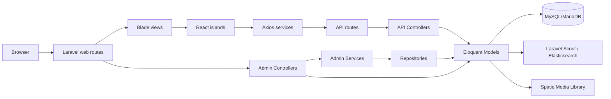

# Cosmetic Shop React + Laravel

Ứng dụng quản lý và bán mỹ phẩm được xây dựng bằng **Laravel 11**, **Blade**, **React 19** và **Vite**. Mã nguồn hiện kết hợp server-rendered Blade với các **React islands** cho giao diện public/admin, có khu vực quản trị `/admin`, CRUD API cho catalog, phân quyền admin theo role và nền tảng dữ liệu cho giỏ hàng, đơn hàng, địa chỉ giao hàng, khuyến mãi, bình luận và newsletter.

## Mục lục

- [Tính năng hiện có](#tính-năng-hiện-có)
- [Công nghệ sử dụng](#công-nghệ-sử-dụng)
- [Kiến trúc tổng quan](#kiến-trúc-tổng-quan)
- [Cấu trúc thư mục](#cấu-trúc-thư-mục)
- [Yêu cầu môi trường](#yêu-cầu-môi-trường)
- [Cài đặt và chạy dự án](#cài-đặt-và-chạy-dự-án)
- [Cấu hình quan trọng](#cấu-hình-quan-trọng)
- [Scripts thường dùng](#scripts-thường-dùng)
- [Routes chính](#routes-chính)
- [API](#api)
- [Mô hình dữ liệu](#mô-hình-dữ-liệu)
- [Kiểm thử](#kiểm-thử)
- [Ghi chú phát triển](#ghi-chú-phát-triển)

## Tính năng hiện có

### Public frontend

- Trang welcome tại `/` dùng React component `PublicWelcomePage`.
- Hệ component public cho header, sidebar, footer, auth modal, cart modal, product card/grid, cart và shipping address form.
- React islands được mount qua thuộc tính `data-react-component` trong Blade.
- Các JS service dùng Axios để gọi API: brand, category, product/search.
- Có view/layout public trong `resources/views/layout`, tuy nhiên một số route được layout tham chiếu như `product.index`, `login`, `register`, `payment.create`, `customer.orders` chưa thấy được khai báo trong `routes/web.php` hiện tại.

### Admin web

- Đăng nhập/đăng xuất admin qua guard riêng `admin`.
- Middleware `admin` kiểm tra đăng nhập và trạng thái active.
- Middleware `admin.role` giới hạn quyền theo role.
- Dashboard admin bằng React component `AdminDashboard`.
- CRUD web cho:
  - Brand
  - Category, bao gồm danh mục cha/con
  - Product
- Giao diện bảng/form admin dùng các component React tái sử dụng:
  - `AdminResourceTable`
  - `AdminResourceForm`
  - `AdminApiResourceManager`
  - `AdminSidebar`, `AdminTopNav`, `AdminFooterLogout`
- Trang quản lý role và staff dùng API resource manager.

### Admin/API

- API catalog được bảo vệ bằng `auth:sanctum` và `admin.role`:
  - Brands
  - Categories
  - Products
  - Product search
- API quản lý staff và role:
  - Staffs: role `MANAGER`, `ADMIN`
  - Roles: role `MANAGER`
- Nhánh web `/admin/api/*` cũng expose API role/staff cho giao diện admin session.

### Search và media

- Laravel Scout + Matchish Elasticsearch được cấu hình cho search.
- Model có Scout Searchable:
  - `Brand` → index `brands_index`
  - `Category`
  - `Product`
- `Brand` tích hợp Spatie Media Library với collection `brands`.

## Công nghệ sử dụng

### Backend

| Thành phần | Phiên bản/Gói |
|---|---|
| PHP | `^8.2` |
| Laravel | `^11.0` |
| Auth/API token | `laravel/sanctum ^4.0` |
| Search | `laravel/scout ^10.15`, `matchish/laravel-scout-elasticsearch ^7.11`, `elasticsearch/elasticsearch ^8.18` |
| Media | `spatie/laravel-medialibrary ^11.13` |
| HTTP | Guzzle, PHP HTTP adapter/discovery |
| Test PHP | PHPUnit `^10.1` |
| Dev tooling | Laravel Pint, Sail, Collision, Ignition |

### Frontend

| Thành phần | Phiên bản/Gói |
|---|---|
| React | `^19.2.6` |
| React DOM | `^19.2.6` |
| Vite | `^6.4.2` |
| Laravel Vite Plugin | `^1.0.0` |
| Axios | `^1.6.4` |
| Test JS | Vitest `^4.1.7`, Testing Library, Happy DOM/JSDOM |

## Kiến trúc tổng quan



### Luồng web admin

1. Người dùng truy cập `/admin/...`.
2. Middleware `admin` xác thực `Auth::guard('admin')`.
3. Controller trong `app/Http/Controllers/Admin` nhận request.
4. Với brand/category/product, controller gọi service trong `app/Services/Admin`.
5. Service xử lý nghiệp vụ cơ bản, ví dụ gán `created_by`, rồi gọi repository.
6. Repository thao tác Eloquent model và trả dữ liệu về view.
7. Blade render container `data-react-component`, sau đó React island mount component tương ứng.

### Luồng API

1. Request vào `/api/*` qua `routes/api.php`.
2. Middleware `auth:sanctum` xác thực user/admin token.
3. Middleware `admin.role` kiểm tra quyền theo role.
4. API controller trả JSON cho React/Axios hoặc client khác.

## Cấu trúc thư mục

```text
app/
  Http/
    Controllers/
      Admin/              # Controller web admin: login, dashboard, brand, category, product, role, staff
      Api/                # Controller JSON API cho catalog, role, staff
    Middleware/           # admin, admin.role, customer, auth...
    Requests/             # Form Request validation
  Models/                 # Eloquent models
  Repositories/           # Repository layer cho brand/category/product
  Services/Admin/         # Service layer cho brand/category/product

config/                   # Cấu hình Laravel, auth guards/providers, scout, media-library...
database/
  migrations/             # Schema database
  seeders/                # Seeder hiện chưa tạo dữ liệu mặc định
public/                   # Public assets và entry index.php
resources/
  css/                    # CSS entry
  js/
    components/           # React components public/admin/common/product/cart
    islands/              # Cơ chế mount React islands
    pages/                # React pages
    services/             # Axios API clients
    test/                 # Setup Vitest
  lang/                   # Bản dịch en/vi
  views/                  # Blade views public/admin/layout/vendor media-library
routes/
  web.php                 # Web routes public + admin
  api.php                 # Protected API routes
  channels.php            # Broadcast channels
  console.php             # Artisan closure command mặc định
tests/                    # PHPUnit test skeleton
```

## Yêu cầu môi trường

- PHP 8.2+
- Composer
- Node.js 20+ và npm
- MySQL/MariaDB
- Elasticsearch 8.x nếu bật Scout Elasticsearch

## Cài đặt và chạy dự án

### 1. Cài PHP dependencies

```bash
composer install
```

### 2. Cài Node dependencies

```bash
npm install
```

### 3. Tạo file `.env`

Linux/macOS/Git Bash:

```bash
cp .env.example .env
php artisan key:generate
```

PowerShell:

```powershell
Copy-Item .env.example .env
php artisan key:generate
```

### 4. Cấu hình database

Ví dụ:

```env
DB_CONNECTION=mysql
DB_HOST=127.0.0.1
DB_PORT=3306
DB_DATABASE=cosmetic_shop
DB_USERNAME=root
DB_PASSWORD=
```

### 5. Chạy migration

```bash
php artisan migrate
```

### 6. Tạo symlink storage nếu dùng file public

```bash
php artisan storage:link
```

### 7. Chạy ứng dụng ở local

Terminal 1:

```bash
php artisan serve
```

Terminal 2:

```bash
npm run dev
```

Truy cập:

- Public welcome: `http://127.0.0.1:8000`
- Admin login: `http://127.0.0.1:8000/admin/login`

### 8. Build production assets

```bash
npm run build
```

## Cấu hình quan trọng

### Auth admin

Trong `config/auth.php` có guard/provider riêng:

- Guard: `admin`
- Provider: `admins`
- Model: `App\Models\Admin`

`AdminMiddleware` redirect về `/admin/login` nếu chưa đăng nhập hoặc admin không hợp lệ.

### Role admin

Model `Admin` định nghĩa role:

```php
MANAGER, ADMIN, STAFF
```

`AdminRoleMiddleware` dùng cho cả web route và API route để giới hạn quyền.

### Vite entries

`vite.config.js` build 3 entry:

```js
resources/css/app.css
resources/js/public.jsx
resources/js/admin.jsx
```

### React islands

Các Blade view mount React bằng pattern:

```html
<div data-react-component="ComponentName" data-props='{}'></div>
```

Registry public nằm trong `resources/js/public.jsx`; registry admin nằm trong `resources/js/admin.jsx`.

### Elasticsearch / Scout

`.env.example` có cấu hình:

```env
SCOUT_DRIVER=Matchish\ScoutElasticSearch\Engines\ElasticSearchEngine
ELASTICSEARCH_HOST=
SCOUT_QUEUE=false
```

Nếu môi trường local chưa có Elasticsearch, cần cấu hình `ELASTICSEARCH_HOST` đúng hoặc điều chỉnh Scout driver khi phát triển.

## Scripts thường dùng

```bash
# Vite dev server
npm run dev

# Build assets
npm run build

# Chạy test frontend một lần
npm test

# Chạy test frontend watch mode
npm run test:watch

# Chạy test PHP
php artisan test

# Liệt kê route
php artisan route:list

# Format PHP bằng Pint
./vendor/bin/pint
```

> Các lệnh `php artisan ...` yêu cầu đã chạy `composer install` để có `vendor/autoload.php`.

## License

Dự án sử dụng giấy phép MIT theo `composer.json`.

