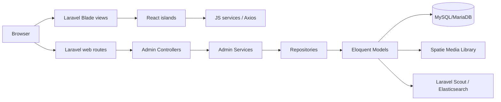

# Cosmetic Shop React + Laravel

Ứng dụng thương mại điện tử mỹ phẩm được xây dựng bằng **Laravel 11**, **Blade**, **React 19** và **Vite**. Dự án hiện có giao diện public dạng React islands, khu vực quản trị `/admin`, các module quản lý danh mục/nhãn hàng/sản phẩm, media upload, xác thực admin và nền tảng dữ liệu cho giỏ hàng, đơn hàng, địa chỉ giao hàng, khuyến mãi, bình luận và newsletter.

> Ghi chú: README này được cập nhật theo mã nguồn hiện tại. Một số bảng/chức năng nghiệp vụ đã có model/migration nhưng chưa có đầy đủ controller/route public tương ứng.

## Mục lục

- [Tính năng chính](#tính-năng-chính)
- [Công nghệ sử dụng](#công-nghệ-sử-dụng)
- [Kiến trúc tổng quan](#kiến-trúc-tổng-quan)
- [Cấu trúc thư mục](#cấu-trúc-thư-mục)
- [Yêu cầu môi trường](#yêu-cầu-môi-trường)
- [Cài đặt và chạy dự án](#cài-đặt-và-chạy-dự-án)
- [Cấu hình quan trọng](#cấu-hình-quan-trọng)
- [Scripts thường dùng](#scripts-thường-dùng)
- [Kiểm thử](#kiểm-thử)
- [Các route chính](#các-route-chính)
- [Mô hình dữ liệu](#mô-hình-dữ-liệu)
- [Ghi chú phát triển](#ghi-chú-phát-triển)

## Tính năng chính

### Public/customer

- Trang chủ public render bằng Blade kết hợp React islands.
- Header, sidebar, footer, modal đăng nhập/đăng ký và modal giỏ hàng bằng React component.
- Thành phần hiển thị sản phẩm, product grid và product card.
- Form địa chỉ giao hàng theo mô hình tỉnh/thành, quận/huyện, phường/xã.
- Nền tảng dữ liệu cho:
  - Người dùng (`users`)
  - Giỏ hàng (`shopping_cart`)
  - Đơn hàng và chi tiết đơn hàng (`orders`, `order_items`)
  - Bình luận/đánh giá sản phẩm (`comments`)
  - Mã giảm giá (`discounts`)
  - Newsletter (`news_letters`)

### Admin

- Đăng nhập/đăng xuất admin với guard riêng `admin`.
- Middleware `admin` bảo vệ khu vực quản trị.
- Dashboard admin.
- CRUD nhãn hàng (`brands`).
- CRUD danh mục (`categories`) có hỗ trợ danh mục cha/con.
- CRUD sản phẩm (`products`) và lọc/list theo nhóm.
- Bật/tắt trạng thái nhãn hàng, danh mục, sản phẩm.
- Upload ảnh nhãn hàng qua Spatie Media Library.
- Kiến trúc theo lớp Controller → Service → Repository cho các module admin chính.

### Frontend React

- Entry public: `resources/js/public.jsx`.
- Entry admin: `resources/js/admin.jsx`.
- Cơ chế mount React islands: `resources/js/islands/mountReactIslands.jsx`.
- Component admin có test bằng Vitest + Testing Library.
- Component public có test bằng Vitest + Testing Library.

## Công nghệ sử dụng

### Backend

- PHP `^8.2`
- Laravel `^11.0`
- Laravel Sanctum `^4.0`
- Laravel Scout `^10.15`
- Elasticsearch PHP client `^8.18`
- Matchish Laravel Scout Elasticsearch `^7.11`
- Spatie Laravel Media Library `^11.13`
- PHPUnit `^10.1`
- Laravel Pint

### Frontend

- React `^19.2.6`
- React DOM `^19.2.6`
- Vite `^6.4.2`
- Laravel Vite Plugin `^1.0.0`
- Axios `^1.6.4`
- Vitest `^4.1.7`
- Testing Library React/Jest DOM/User Event
- Happy DOM

## Kiến trúc tổng quan



Luồng admin hiện tại:

1. Request vào route `/admin/...`.
2. Route gọi controller trong `app/Http/Controllers/Admin`.
3. Controller dùng service trong `app/Services/Admin`.
4. Service xử lý nghiệp vụ, gán `created_by`, gọi repository.
5. Repository thao tác Eloquent model.
6. View Blade admin nhúng React component khi cần.

## Cấu trúc thư mục

```text
app/
  Http/Controllers/Admin/   # Controller cho dashboard, login, brand, category, product
  Http/Middleware/          # Middleware admin/customer/auth
  Http/Requests/            # Form Request validation
  Models/                   # Eloquent models
  Repositories/             # Repository layer
  Services/Admin/           # Service layer cho admin
config/                     # Cấu hình Laravel, auth guard admin
 database/
  migrations/               # Schema database
  seeders/                  # Seeder hiện chưa tạo dữ liệu mặc định
resources/
  css/                      # CSS entry
  js/                       # React entries, components, services, tests
  lang/                     # Bản dịch en/vi
  views/                    # Blade public/admin/layout/vendor media-library
routes/
  web.php                   # Web routes public + admin
  api.php                   # API route mặc định /api/user với Sanctum
  channels.php              # Broadcast channel mặc định
  console.php               # Artisan closure command mặc định
```

## Yêu cầu môi trường

- PHP 8.2 trở lên
- Composer
- Node.js 20+ và npm
- MySQL hoặc MariaDB
- Elasticsearch 8.x nếu dùng Scout Elasticsearch

## Cài đặt và chạy dự án

### 1. Cài dependency PHP

```bash
composer install
```

### 2. Cài dependency Node

```bash
npm install
```

### 3. Tạo file môi trường

```bash
cp .env.example .env
php artisan key:generate
```

Trên PowerShell có thể dùng:

```powershell
Copy-Item .env.example .env
php artisan key:generate
```

### 4. Cấu hình database trong `.env`

```env
DB_CONNECTION=mysql
DB_HOST=127.0.0.1
DB_PORT=3306
DB_DATABASE=cosmetic_shop
DB_USERNAME=root
DB_PASSWORD=
```

### 5. Chạy migration

```bash
php artisan migrate
```

Seeder hiện tại chưa tạo admin mặc định. Sau khi migrate, bạn cần tự tạo bản ghi trong bảng `admins` hoặc bổ sung seeder trước khi đăng nhập `/admin/login`.

### 6. Liên kết storage nếu dùng file public

```bash
php artisan storage:link
```

### 7. Chạy frontend dev server

```bash
npm run dev
```

### 8. Chạy Laravel server

```bash
php artisan serve
```

Sau đó truy cập:

- Public site: `http://127.0.0.1:8000`
- Admin login: `http://127.0.0.1:8000/admin/login`

## Cấu hình quan trọng

### Auth admin

Dự án có guard riêng cho admin trong `config/auth.php`:

- Guard: `admin`
- Provider: `admins`
- Model: `App\Models\Admin`

Middleware `App\Http\Middleware\AdminMiddleware` kiểm tra `Auth::guard('admin')->check()` và redirect về `/admin/login` nếu chưa đăng nhập.

### Elasticsearch / Scout

`.env.example` đang khai báo:

```env
SCOUT_DRIVER=Matchish\ScoutElasticSearch\Engines\ElasticSearchEngine
ELASTICSEARCH_HOST=
SCOUT_QUEUE=false
```

Model `Brand` hiện sử dụng `Laravel\Scout\Searchable`, định nghĩa index `brands_index` và media collection `brands`.

Nếu chưa chạy Elasticsearch trong môi trường local, hãy cấu hình `ELASTICSEARCH_HOST` phù hợp hoặc tạm điều chỉnh Scout theo nhu cầu phát triển.

### Vite entries

`vite.config.js` build các entry sau:

- `resources/css/app.css`
- `resources/js/public.jsx`
- `resources/js/admin.jsx`

## Scripts thường dùng

```bash
# Chạy Vite dev server
npm run dev

# Build asset production
npm run build

# Chạy test frontend một lần
npm test

# Chạy test frontend ở watch mode
npm run test:watch

# Chạy test PHP
php artisan test

# Format code PHP bằng Pint
./vendor/bin/pint
```

## Kiểm thử

Dự án có test frontend cho các React component trong `resources/js/components/**`.

Kết quả kiểm thử gần nhất khi cập nhật README:

```text
Test Files  13 passed (13)
Tests       26 passed (26)
```

Lệnh đã chạy:

```bash
npm test
```

Ghi chú: lệnh `php artisan route:list`/`php artisan test` cần thư mục `vendor`. Tại thời điểm rà soát, `vendor/autoload.php` chưa tồn tại trong workspace nên cần chạy `composer install` trước.

## Các route chính

### Public

| Method | Path | Mô tả |
|---|---|---|
| GET | `/` | Trang welcome/public home |

### Admin auth

| Method | Path | Name | Mô tả |
|---|---|---|---|
| GET | `/admin/login` | `admin.login.form` | Form đăng nhập admin |
| POST | `/admin/login` | `admin.login` | Xử lý đăng nhập admin |
| POST | `/admin/logout` | `admin.logout` | Đăng xuất admin |

### Admin dashboard

| Method | Path | Name |
|---|---|---|
| GET | `/admin` | `admin.dashboard` |

### Admin brands

| Method | Path | Name |
|---|---|---|
| GET | `/admin/brands` | `admin.brand.index` |
| GET | `/admin/brands/create` | `admin.brand.create` |
| POST | `/admin/brands/store` | `admin.brand.store` |
| GET | `/admin/brands/edit/{id}` | `admin.brand.edit` |
| PATCH | `/admin/brands/update/{brand}` | `admin.brand.update` |
| DELETE | `/admin/brands/delete/{brand}` | `admin.brand.destroy` |
| POST | `/admin/brands/changeStatus/{brand}` | `admin.brand.change_status` |

### Admin categories

| Method | Path | Name |
|---|---|---|
| GET | `/admin/categories` | `admin.category.index` |
| GET | `/admin/categories/create` | `admin.category.create` |
| POST | `/admin/categories/store` | `admin.category.store` |
| GET | `/admin/categories/edit/{id}` | `admin.category.edit` |
| PATCH | `/admin/categories/update/{category}` | `admin.category.update` |
| DELETE | `/admin/categories/delete/{category}` | `admin.category.destroy` |
| POST | `/admin/categories/changeStatus/{category}` | `admin.category.change_status` |
| GET | `/admin/categories/{id}` | `admin.category.list` |
| GET | `/admin/categories/{id}/create` | `admin.category.create.child` |
| POST | `/admin/categories/{id}/store` | `admin.category.store.child` |
| GET | `/admin/categories/{id}/edit/{category}` | `admin.category.edit.child` |
| PATCH | `/admin/categories/{id}/update/{category}` | `admin.category.update.child` |

### Admin products

| Method | Path | Name |
|---|---|---|
| GET | `/admin/products` | `admin.product.index` |
| GET | `/admin/products/create` | `admin.product.create` |
| POST | `/admin/products/store` | `admin.product.store` |
| GET | `/admin/products/edit/{id}` | `admin.product.edit` |
| PATCH | `/admin/products/update/{product}` | `admin.product.update` |
| DELETE | `/admin/products/delete/{product}` | `admin.product.destroy` |
| POST | `/admin/products/changeStatus/{product}` | `admin.product.change_status` |
| GET | `/admin/products/{id}` | `admin.product.list` |
| GET | `/admin/products/{id}/create` | `admin.product.create.child` |
| POST | `/admin/products/{id}/store` | `admin.product.store.child` |
| GET | `/admin/products/{id}/edit/{product}` | `admin.product.edit.child` |
| PATCH | `/admin/products/{id}/update/{product}` | `admin.product.update.child` |

## Mô hình dữ liệu

Các bảng nghiệp vụ chính từ migrations:

| Bảng | Mục đích |
|---|---|
| `admins` | Tài khoản quản trị, role cơ bản, trạng thái active |
| `brands` | Nhãn hàng sản phẩm |
| `categories` | Danh mục cha/con |
| `products` | Sản phẩm, giá, giảm giá, tồn kho, featured |
| `media` | File/media theo Spatie Media Library |
| `comments` | Đánh giá/bình luận sản phẩm |
| `discounts` | Mã giảm giá |
| `shopping_cart` | Nội dung giỏ hàng theo identifier/instance |
| `orders` | Đơn hàng, giao hàng, thanh toán, tổng tiền, trạng thái |
| `order_items` | Dòng sản phẩm trong đơn hàng |
| `provinces`, `districts`, `wards` | Dữ liệu địa chỉ giao hàng |
| `transports` | Phí vận chuyển theo tỉnh/thành |
| `roles`, `permissions`, `permission_role` | Nền tảng phân quyền |
| `news_letters` | Email đăng ký nhận tin |

## Ghi chú phát triển

- Chạy `composer install` trước các lệnh Artisan vì repository hiện không có thư mục `vendor`.
- `DatabaseSeeder` chưa seed dữ liệu mẫu/admin; nên bổ sung seeder để onboarding dễ hơn.
- Một số repository đang dùng `Model::all()->where(...)`, phù hợp dữ liệu nhỏ nhưng nên chuyển sang query builder/Eloquent query khi dữ liệu tăng.
- Product hiện chưa implement Media Library giống Brand; nếu cần quản lý nhiều ảnh sản phẩm, nên chuẩn hóa collection media cho product.
- Các model nghiệp vụ đã có nhưng public checkout/order/comment/newsletter chưa có đầy đủ route/controller trong mã nguồn hiện tại.

## License

Dự án sử dụng giấy phép MIT theo cấu hình `composer.json`.
